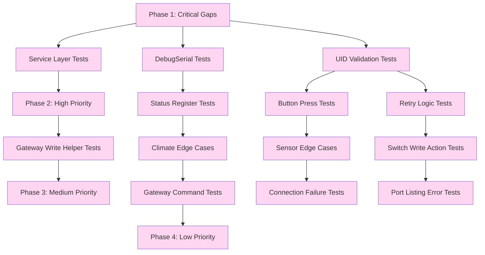

# Comprehensive Test Strategy for 90%+ Coverage

## Executive Summary

This document provides a comprehensive, prioritized test strategy to achieve 90%+ coverage for the Ectocontrol Modbus Controller Home Assistant integration. The strategy is organized into 4 phases based on coverage impact and complexity.

**Current State:** 85% overall coverage with 233 missed lines across 14 modules.

**Target State:** 90%+ overall coverage across all modules.

---

## 1. Test Organization Structure

### 1.1 New Test Files to Create

| File Name | Rationale | Primary Focus |
|------------|-----------|---------------|
| `test_init_services.py` | Test service layer (0% coverage) | Service handlers, service registration, service calls |
| `test_modbus_debug_serial.py` | Test DebugSerial wrapper (0% coverage) | TX/RX logging, property forwarding |
| `test_init_setup_entry.py` | Test async_setup_entry edge cases | UID validation, device info updates, protocol manager errors |
| `test_coordinator_retry.py` | Test retry logic comprehensively | Exponential backoff, retry exhaustion, error handling |
| `test_gateway_status_register.py` | Test register status handling | All status codes, boundary conditions |
| `test_gateway_write_helpers.py` | Test gateway write operations | Circuit enable, setpoint, modulation writes |
| `test_gateway_commands.py` | Test command operations | Reboot, reset errors, command result reading |
| `test_climate_edge_cases.py` | Test climate entity edge cases | UID errors, fallback logic, mode transitions |
| `test_switch_write_actions.py` | Test switch entity write actions | Circuit enable bit operations, refresh calls |
| `test_sensor_edge_cases.py` | Test sensor entity edge cases | Invalid markers, status register handling |

### 1.2 Existing Test Files to Enhance

| File | Current Coverage | Enhancements Needed |
|-------|-----------------|---------------------|
| `test_init_module.py` | Basic setup/unload only | Add service handler tests, error paths, cleanup tests |
| `test_coordinator.py` | Basic polling only | Add retry backoff verification, error logging tests |
| `test_entities_buttons.py` | Basic button tests only | Add async_press action tests, availability tests |
| `test_boiler_gateway.py` | Basic getter tests only | Add write helper tests, command tests, status tests |
| `test_modbus_protocol.py` | Connection/read/write tests | Add DebugSerial tests, timeout variations, error path tests |
| `test_config_flow.py` | Port validation only | Add slave ID uniqueness tests, connection test edge cases |
| `test_entities.py` | Basic sensor tests | Add status register tests, invalid marker tests |
| `test_entities_climate.py` | Basic climate tests | Add UID error tests, fallback logic tests |
| `test_coverage_gaps.py` | Comprehensive gap coverage | Refactor into focused test files, add missing scenarios |

### 1.3 Test File Naming Conventions

- **Pattern:** `test_{module}_{focus}.py`
- **Examples:**
  - `test_init_services.py` - Tests for `__init__.py` service layer
  - `test_modbus_debug_serial.py` - Tests for `modbus_protocol.py` DebugSerial
  - `test_coordinator_retry.py` - Tests for `coordinator.py` retry logic
  - `test_gateway_status_register.py` - Tests for `boiler_gateway.py` status register handling

### 1.4 Organization Principles

1. **Single Responsibility:** Each test file focuses on one module or feature area
2. **Logical Grouping:** Related tests grouped together (e.g., all status register tests)
3. **Clear Naming:** Test names clearly indicate what is being tested
4. **Consistent Patterns:** Use same mock/fake patterns across all test files
5. **Avoid Duplication:** Don't repeat tests across files; use parameterized tests instead

---

## 2. Prioritized Implementation Plan

### Phase 1: Critical Gaps (Must Fix First)

**Impact:** ~15-20% coverage increase overall

#### 2.1 Service Layer Tests (0% → 80%+)

**File:** `test_init_services.py`

**Tests to Add:**

1. `test_service_handler_reboot_adapter()`
   - **Purpose:** Test `_service_handler` with reboot command (2)
   - **Setup:** Create fake gateway, coordinator, service call data
   - **Verify:** Gateway `reboot_adapter()` called with correct parameters
   - **Verify:** Coordinator `async_request_refresh()` called after command
   - **Verify:** Entry ID resolution (single entry, multiple entries)
   - **Coverage Impact:** ~15 lines (service handler + entry resolution)

2. `test_service_handler_reset_boiler_errors()`
   - **Purpose:** Test `_service_handler` with reset errors command (3)
   - **Setup:** Create fake gateway, coordinator, service call data
   - **Verify:** Gateway `reset_boiler_errors()` called with correct parameters
   - **Verify:** Coordinator `async_request_refresh()` called after command
   - **Verify:** Entry ID resolution (single entry, multiple entries)
   - **Coverage Impact:** ~15 lines

3. `test_service_handler_read_write_registers()`
   - **Purpose:** Test `_read_write_registers_service` diagnostic service
   - **Setup:** Create fake gateway with cache, protocol mock
   - **Verify:** All write registers read and logged
   - **Verify:** Correct scaling applied (CH_SETPOINT, DHW_SETPOINT, etc.)
   - **Verify:** Format matches expected output
   - **Coverage Impact:** ~28 lines

4. `test_service_registration()`
   - **Purpose:** Test service registration in `async_setup_entry`
   - **Setup:** Mock hass.services.async_register
   - **Verify:** All three services registered (reboot_adapter, reset_boiler_errors, read_write_registers)
   - **Verify:** Service names match expected
   - **Coverage Impact:** ~10 lines

**Estimated Coverage Increase:** +18% for `__init__.py` (64% → 82%)

#### 2.2 DebugSerial Wrapper Tests (0% → 90%+)

**File:** `test_modbus_debug_serial.py`

**Tests to Add:**

1. `test_debug_serial_read_with_data()`
   - **Purpose:** Test `read()` method with data returned
   - **Setup:** Create fake serial instance with read data, mock logger
   - **Verify:** Read returns correct data
   - **Verify:** Debug log shows correct hex format
   - **Coverage Impact:** ~10 lines

2. `test_debug_serial_read_timeout()`
   - **Purpose:** Test `read()` method with timeout (0 bytes)
   - **Setup:** Create fake serial instance returning empty bytes
   - **Verify:** Read returns empty bytes
   - **Verify:** Debug log shows timeout message
   - **Coverage Impact:** ~8 lines

3. `test_debug_serial_write()`
   - **Purpose:** Test `write()` method
   - **Setup:** Create fake serial instance, mock logger
   - **Verify:** Write delegates to wrapped serial
   - **Verify:** Debug log shows TX bytes in hex format
   - **Coverage Impact:** ~8 lines

4. `test_debug_serial_flush()`
   - **Purpose:** Test `flush()` method
   - **Setup:** Create fake serial instance
   - **Verify:** Flush delegates to wrapped serial
   - **Coverage Impact:** ~5 lines

5. `test_debug_serial_flush_input()`
   - **Purpose:** Test `flushInput()` method
   - **Setup:** Create fake serial instance
   - **Verify:** FlushInput delegates to wrapped serial
   - **Coverage Impact:** ~5 lines

6. `test_debug_serial_flush_output()`
   - **Purpose:** Test `flushOutput()` method
   - **Setup:** Create fake serial instance
   - **Verify:** FlushOutput delegates to wrapped serial
   - **Coverage Impact:** ~5 lines

7. `test_debug_serial_close()`
   - **Purpose:** Test `close()` method
   - **Setup:** Create fake serial instance
   - **Verify:** Close delegates to wrapped serial
   - **Verify:** Debug log shows close
   - **Coverage Impact:** ~5 lines

8. `test_debug_serial_is_open()`
   - **Purpose:** Test `isOpen()` property
   - **Setup:** Create fake serial instance with open state
   - **Verify:** Property returns correct state
   - **Coverage Impact:** ~5 lines

9. `test_debug_serial_port_property()`
   - **Purpose:** Test `port` property
   - **Setup:** Create fake serial instance
   - **Verify:** Property delegates to wrapped serial
   - **Coverage Impact:** ~5 lines

10. `test_debug_serial_baudrate_property()`
    - **Purpose:** Test `baudrate` property
    - **Setup:** Create fake serial instance
    - **Verify:** Property delegates to wrapped serial
    - **Coverage Impact:** ~5 lines

11. `test_debug_serial_timeout_property()`
    - **Purpose:** Test `timeout` property getter
    - **Setup:** Create fake serial instance
    - **Verify:** Property delegates to wrapped serial
    - **Coverage Impact:** ~5 lines

12. `test_debug_serial_timeout_setter()`
    - **Purpose:** Test `timeout` property setter
    - **Setup:** Create fake serial instance
    - **Verify:** Setter delegates to wrapped serial
    - **Coverage Impact:** ~5 lines

13. `test_debug_serial_bytesize_property()`
    - **Purpose:** Test `bytesize` property
    - **Setup:** Create fake serial instance
    - **Verify:** Property delegates to wrapped serial
    - **Coverage Impact:** ~5 lines

14. `test_debug_serial_parity_property()`
    - **Purpose:** Test `parity` property
    - **Setup:** Create fake serial instance
    - **Verify:** Property delegates to wrapped serial
    - **Coverage Impact:** ~5 lines

15. `test_debug_serial_stopbits_property()`
    - **Purpose:** Test `stopbits` property
    - **Setup:** Create fake serial instance
    - **Verify:** Property delegates to wrapped serial
    - **Coverage Impact:** ~5 lines

16. `test_debug_serial_in_waiting_property()`
    - **Purpose:** Test `in_waiting` property
    - **Setup:** Create fake serial instance
    - **Verify:** Property delegates to wrapped serial
    - **Coverage Impact:** ~5 lines

17. `test_debug_serial_unknown_attribute_forwarding()`
    - **Purpose:** Test `__getattr__` method forwards unknown attributes
    - **Setup:** Create fake serial instance
    - **Verify:** Unknown attributes delegate to wrapped serial
    - **Coverage Impact:** ~5 lines

**Estimated Coverage Increase:** +18% for `modbus_protocol.py` (72% → 90%)

#### 2.3 UID Validation Error Paths

**File:** `test_init_setup_entry.py` (enhance existing)

**Tests to Add:**

1. `test_setup_entry_uid_not_available()`
   - **Purpose:** Test `async_setup_entry` when UID not available
   - **Setup:** Create fake gateway with `device_uid = None`, fake protocol
   - **Verify:** Setup returns False
   - **Verify:** Error logged about UID not available
   - **Verify:** No device created in registry
   - **Coverage Impact:** ~10 lines

2. `test_setup_entry_uid_none_after_read_device_info()`
   - **Purpose:** Test UID becomes None after `read_device_info()` call
   - **Setup:** Create fake gateway with UID initially set, then cleared
   - **Verify:** Setup returns False
   - **Verify:** Error logged about UID not available
   - **Coverage Impact:** ~10 lines

3. `test_setup_entry_uid_none_in_climate_unique_id()`
   - **Purpose:** Test climate entity unique_id raises ValueError when UID not available
   - **Setup:** Create fake gateway with `device_uid = None`, create climate entity
   - **Verify:** `unique_id` property raises ValueError
   - **Verify:** Error message matches expected
   - **Coverage Impact:** ~8 lines

4. `test_setup_entry_uid_none_in_dhw_climate_unique_id()`
   - **Purpose:** Test DHW climate entity unique_id raises ValueError when UID not available
   - **Setup:** Create fake gateway with `device_uid = None`, create DHW climate entity
   - **Verify:** `unique_id` property raises ValueError
   - **Verify:** Error message matches expected
   - **Coverage Impact:** ~8 lines

**Estimated Coverage Increase:** +3% for `__init__.py` (64% → 67%) and +2% for `climate.py` (85% → 87%)

---

### Phase 2: High Priority Gaps

**Impact:** ~8-10% coverage increase overall

#### 2.4 Status Register Error Handling Tests

**File:** `test_gateway_status_register.py`

**Tests to Add:**

1. `test_get_ch_temperature_status_not_supported()`
   - **Purpose:** Test CH temperature getter when status is NOT_SUPPORTED
   - **Setup:** Gateway cache with status = NOT_SUPPORTED
   - **Verify:** Returns None
   - **Verify:** Warning log emitted
   - **Coverage Impact:** ~8 lines

2. `test_get_ch_temperature_status_read_write_error()`
   - **Purpose:** Test CH temperature getter when status is READ_WRITE_ERROR
   - **Setup:** Gateway cache with status = READ_WRITE_ERROR
   - **Verify:** Returns None
   - **Verify:** Error log emitted
   - **Coverage Impact:** ~8 lines

3. `test_get_ch_temperature_status_not_initialized()`
   - **Purpose:** Test CH temperature getter when status is NOT_INITIALIZED
   - **Setup:** Gateway cache with status = NOT_INITIALIZED
   - **Verify:** Returns None
   - **Verify:** Debug log emitted
   - **Coverage Impact:** ~8 lines

4. `test_get_dhw_temperature_status_not_supported()`
   - **Purpose:** Test DHW temperature getter when status is NOT_SUPPORTED
   - **Setup:** Gateway cache with status = NOT_SUPPORTED
   - **Verify:** Returns None
   - **Verify:** Warning log emitted
   - **Coverage Impact:** ~8 lines

5. `test_get_dhw_temperature_status_read_write_error()`
   - **Purpose:** Test DHW temperature getter when status is READ_WRITE_ERROR
   - **Setup:** Gateway cache with status = READ_WRITE_ERROR
   - **Verify:** Returns None
   - **Verify:** Error log emitted
   - **Coverage Impact:** ~8 lines

6. `test_get_pressure_status_not_supported()`
   - **Purpose:** Test pressure getter when status is NOT_SUPPORTED
   - **Setup:** Gateway cache with status = NOT_SUPPORTED
   - **Verify:** Returns None
   - **Verify:** Warning log emitted
   - **Coverage Impact:** ~8 lines

7. `test_get_pressure_status_read_write_error()`
   - **Purpose:** Test pressure getter when status is READ_WRITE_ERROR
   - **Setup:** Gateway cache with status = READ_WRITE_ERROR
   - **Verify:** Returns None
   - **Verify:** Error log emitted
   - **Coverage Impact:** ~8 lines

8. `test_get_flow_rate_status_not_supported()`
   - **Purpose:** Test flow rate getter when status is NOT_SUPPORTED
   - **Setup:** Gateway cache with status = NOT_SUPPORTED
   - **Verify:** Returns None
   - **Verify:** Warning log emitted
   - **Coverage Impact:** ~8 lines

9. `test_get_flow_rate_status_read_write_error()`
   - **Purpose:** Test flow rate getter when status is READ_WRITE_ERROR
   - **Setup:** Gateway cache with status = READ_WRITE_ERROR
   - **Verify:** Returns None
   - **Verify:** Error log emitted
   - **Coverage Impact:** ~8 lines

10. `test_get_modulation_level_status_not_supported()`
    - **Purpose:** Test modulation getter when status is NOT_SUPPORTED
    - **Setup:** Gateway cache with status = NOT_SUPPORTED
    - **Verify:** Returns None
    - **Verify:** Warning log emitted
    - **Coverage Impact:** ~8 lines

11. `test_get_modulation_level_status_read_write_error()`
    - **Purpose:** Test modulation getter when status is READ_WRITE_ERROR
    - **Setup:** Gateway cache with status = READ_WRITE_ERROR
    - **Verify:** Returns None
    - **Verify:** Error log emitted
    - **Coverage Impact:** ~8 lines

12. `test_get_outdoor_temperature_status_not_supported()`
   - **Purpose:** Test outdoor temperature getter when status is NOT_SUPPORTED
   - **Setup:** Gateway cache with status = NOT_SUPPORTED
   - **Verify:** Returns None
   - **Verify:** Warning log emitted
   - **Coverage Impact:** ~8 lines

13. `test_get_outdoor_temperature_status_read_write_error()`
   - **Purpose:** Test outdoor temperature getter when status is READ_WRITE_ERROR
   - **Setup:** Gateway cache with status = READ_WRITE_ERROR
   - **Verify:** Returns None
   - **Verify:** Error log emitted
   - **Coverage Impact:** ~8 lines

14. `test_get_ch_setpoint_active_status_not_supported()`
   - **Purpose:** Test CH setpoint active getter when status is NOT_SUPPORTED
   - **Setup:** Gateway cache with status = NOT_SUPPORTED
   - **Verify:** Returns None
   - **Verify:** Warning log emitted
   - **Coverage Impact:** ~8 lines

15. `test_get_ch_setpoint_active_status_read_write_error()`
   - **Purpose:** Test CH setpoint active getter when status is READ_WRITE_ERROR
   - **Setup:** Gateway cache with status = READ_WRITE_ERROR
   - **Verify:** Returns None
   - **Verify:** Error log emitted
   - **Coverage Impact:** ~8 lines

16. `test_get_ch_setpoint_active_status_not_initialized()`
   - **Purpose:** Test CH setpoint active getter when status is NOT_INITIALIZED
   - **Setup:** Gateway cache with status = NOT_INITIALIZED
   - **Verify:** Returns None
   - **Verify:** Debug log emitted
   - **Coverage Impact:** ~8 lines

**Estimated Coverage Increase:** +5% for `boiler_gateway.py` (87% → 92%)

#### 2.5 Retry Logic Verification Tests

**File:** `test_coordinator_retry.py` (enhance existing)

**Tests to Add:**

1. `test_coordinator_retry_exponential_backoff_timing()`
   - **Purpose:** Verify exponential backoff timing (0.5s × attempt_number)
   - **Setup:** Mock asyncio.sleep, track sleep calls
   - **Verify:** First retry: 0.5s sleep, second: 1.0s sleep, third: 1.5s sleep
   - **Coverage Impact:** ~8 lines

2. `test_coordinator_retry_logging_on_recovery()`
   - **Purpose:** Verify retry recovery logging
   - **Setup:** Mock logger, trigger retry scenario
   - **Verify:** Info log emitted on recovery
   - **Verify:** Log message includes attempt count
   - **Coverage Impact:** ~6 lines

3. `test_coordinator_retry_logging_on_exhaustion()`
   - **Purpose:** Verify retry exhaustion logging
   - **Setup:** Mock logger, trigger all retries fail scenario
   - **Verify:** Error log emitted on exhaustion
   - **Verify:** Log message includes total attempts
   - **Coverage Impact:** ~6 lines

**Estimated Coverage Increase:** +2% for `coordinator.py` (88% → 90%)

#### 2.6 Button Press Action Tests

**File:** `test_entities_buttons.py` (enhance existing)

**Tests to Add:**

1. `test_reboot_button_async_press_calls_gateway()`
   - **Purpose:** Test reboot button `async_press()` calls gateway method
   - **Setup:** Create fake gateway with `reboot_adapter()` mock, fake coordinator
   - **Verify:** Gateway `reboot_adapter()` called
   - **Verify:** Coordinator `async_request_refresh()` called
   - **Coverage Impact:** ~6 lines

2. `test_reset_errors_button_async_press_calls_gateway()`
   - **Purpose:** Test reset errors button `async_press()` calls gateway method
   - **Setup:** Create fake gateway with `reset_boiler_errors()` mock, fake coordinator
   - **Verify:** Gateway `reset_boiler_errors()` called
   - **Verify:** Coordinator `async_request_refresh()` called
   - **Coverage Impact:** ~6 lines

3. `test_reboot_button_unavailable_when_last_update_failed()`
   - **Purpose:** Test button availability when coordinator failed
   - **Setup:** Create fake gateway, coordinator with `last_update_success = False`
   - **Verify:** Button `available` property returns False
   - **Coverage Impact:** ~8 lines

4. `test_reset_errors_button_unavailable_when_last_update_failed()`
   - **Purpose:** Test button availability when coordinator failed
   - **Setup:** Create fake gateway, coordinator with `last_update_success = False`
   - **Verify:** Button `available` property returns False
   - **Coverage Impact:** ~8 lines

**Estimated Coverage Increase:** +2% for `button.py` (88% → 90%)

#### 2.7 Gateway Write Helper Tests

**File:** `test_gateway_write_helpers.py`

**Tests to Add:**

1. `test_set_circuit_enable_bit_set()`
   - **Purpose:** Test `set_circuit_enable_bit()` with enabled=True
   - **Setup:** Create fake gateway with cache, mock protocol write_register
   - **Verify:** Correct bit set in value (current | (1 << bit))
   - **Verify:** Cache updated immediately after write
   - **Verify:** Debug log emitted
   - **Coverage Impact:** ~10 lines

2. `test_set_circuit_enable_bit_clear()`
   - **Purpose:** Test `set_circuit_enable_bit()` with enabled=False
   - **Setup:** Create fake gateway with cache, mock protocol write_register
   - **Verify:** Correct bit cleared in value (current & ~(1 << bit))
   - **Verify:** Cache updated immediately after write
   - **Verify:** Debug log emitted
   - **Coverage Impact:** ~10 lines

3. `test_set_circuit_enable_bit_write_failure()`
   - **Purpose:** Test `set_circuit_enable_bit()` when write fails
   - **Setup:** Create fake gateway with cache, mock protocol write_register returning False
   - **Verify:** Returns False
   - **Verify:** Error log emitted
   - **Verify:** Cache NOT updated after failed write
   - **Coverage Impact:** ~10 lines

4. `test_set_ch_setpoint_updates_cache()`
   - **Purpose:** Test `set_ch_setpoint()` updates shared cache
   - **Setup:** Create fake gateway, mock protocol write_register
   - **Verify:** Cache value updated with scaled temperature
   - **Verify:** Protocol write called with correct raw value
   - **Coverage Impact:** ~8 lines

5. `test_set_dhw_setpoint_success()`
   - **Purpose:** Test `set_dhw_setpoint()` success case
   - **Setup:** Create fake gateway, mock protocol write_register
   - **Verify:** Protocol write called with correct value
   - **Verify:** Returns True
   - **Coverage Impact:** ~8 lines

6. `test_set_max_modulation_success()`
   - **Purpose:** Test `set_max_modulation()` success case
   - **Setup:** Create fake gateway, mock protocol write_register
   - **Verify:** Protocol write called with correct value
   - **Verify:** Returns True
   - **Coverage Impact:** ~8 lines

**Estimated Coverage Increase:** +3% for `boiler_gateway.py` (87% → 90%)

#### 2.8 Climate Entity Edge Cases

**File:** `test_climate_edge_cases.py`

**Tests to Add:**

1. `test_boiler_climate_target_temperature_fallback_midpoint()`
   - **Purpose:** Test fallback to midpoint when setpoint unavailable
   - **Setup:** Create fake gateway with `get_ch_setpoint()` returning None, mock limits
   - **Verify:** Returns (min + max) / 2
   - **Coverage Impact:** ~10 lines

2. `test_dhw_climate_target_temperature_fallback_midpoint()`
   - **Purpose:** Test fallback to midpoint when setpoint unavailable
   - **Setup:** Create fake gateway with `get_dhw_setpoint()` returning None, mock limits
   - **Verify:** Returns (min + max) / 2
   - **Coverage Impact:** ~10 lines

3. `test_boiler_climate_target_temperature_uses_cached_value()`
   - **Purpose:** Test cached value used when setpoint unavailable
   - **Setup:** Create fake gateway with `get_ch_setpoint()` returning None, set cache value
   - **Verify:** Returns cached value
   - **Coverage Impact:** ~8 lines

4. `test_dhw_climate_target_temperature_uses_cached_value()`
   - **Purpose:** Test cached value used when setpoint unavailable
   - **Setup:** Create fake gateway with `get_dhw_setpoint()` returning None, set cache value
   - **Verify:** Returns cached value
   - **Coverage Impact:** ~8 lines

**Estimated Coverage Increase:** +2% for `climate.py` (85% → 87%)

#### 2.9 Switch Entity Write Action Tests

**File:** `test_switch_write_actions.py`

**Tests to Add:**

1. `test_heating_switch_turn_on_calls_gateway()`
   - **Purpose:** Test heating switch turn_on calls gateway
   - **Setup:** Create fake gateway, coordinator, switch entity
   - **Verify:** Gateway `set_circuit_enable_bit(0, True)` called
   - **Verify:** Coordinator `async_request_refresh()` called
   - **Coverage Impact:** ~8 lines

2. `test_heating_switch_turn_off_calls_gateway()`
   - **Purpose:** Test heating switch turn_off calls gateway
   - **Setup:** Create fake gateway, coordinator, switch entity
   - **Verify:** Gateway `set_circuit_enable_bit(0, False)` called
   - **Verify:** Coordinator `async_request_refresh()` called
   - **Coverage Impact:** ~8 lines

3. `test_dhw_switch_turn_on_calls_gateway()`
   - **Purpose:** Test DHW switch turn_on calls gateway
   - **Setup:** Create fake gateway, coordinator, switch entity
   - **Verify:** Gateway `set_circuit_enable_bit(1, True)` called
   - **Verify:** Coordinator `async_request_refresh()` called
   - **Coverage Impact:** ~8 lines

4. `test_dhw_switch_turn_off_calls_gateway()`
   - **Purpose:** Test DHW switch turn_off calls gateway
   - **Setup:** Create fake gateway, coordinator, switch entity
   - **Verify:** Gateway `set_circuit_enable_bit(1, False)` called
   - **Verify:** Coordinator `async_request_refresh()` called
   - **Coverage Impact:** ~8 lines

**Estimated Coverage Increase:** +4% for `switch.py` (81% → 85%)

---

### Phase 3: Medium Priority Gaps

**Impact:** ~3-5% coverage increase overall

#### 3.1 Gateway Command Operation Tests

**File:** `test_gateway_commands.py`

**Tests to Add:**

1. `test_reboot_adapter_success()`
   - **Purpose:** Test `reboot_adapter()` success case
   - **Setup:** Create fake gateway, mock protocol write_register and read_registers
   - **Verify:** Command 2 written to register 0x0080
   - **Verify:** 0.5s sleep after command
   - **Verify:** Command result register read
   - **Verify:** Info log emitted with result description
   - **Coverage Impact:** ~12 lines

2. `test_reboot_adapter_write_failure()`
   - **Purpose:** Test `reboot_adapter()` when write fails
   - **Setup:** Create fake gateway, mock protocol write_register returning False
   - **Verify:** Returns False
   - **Verify:** Error log emitted
   - **Verify:** No command result read attempted
   - **Coverage Impact:** ~10 lines

3. `test_reset_boiler_errors_success()`
   - **Purpose:** Test `reset_boiler_errors()` success case
   - **Setup:** Create fake gateway, mock protocol write_register and read_registers
   - **Verify:** Command 3 written to register 0x0080
   - **Verify:** 0.5s sleep after command
   - **Verify:** Command result register read
   - **Verify:** Info log emitted with result description
   - **Coverage Impact:** ~12 lines

4. `test_reset_boiler_errors_write_failure()`
   - **Purpose:** Test `reset_boiler_errors()` when write fails
   - **Setup:** Create fake gateway, mock protocol write_register returning False
   - **Verify:** Returns False
   - **Verify:** Error log emitted
   - **Verify:** No command result read attempted
   - **Coverage Impact:** ~10 lines

5. `test_read_command_result_success()`
   - **Purpose:** Test `_read_command_result()` success case
   - **Setup:** Create fake gateway, mock protocol read_registers
   - **Verify:** Returns correct result code
   - **Verify:** Signed i16 conversion correct
   - **Coverage Impact:** ~8 lines

6. `test_read_command_result_none()`
   - **Purpose:** Test `_read_command_result()` when read fails
   - **Setup:** Create fake gateway, mock protocol read_registers returning None
   - **Verify:** Returns None
   - **Coverage Impact:** ~6 lines

7. `test_read_command_result_empty()`
   - **Purpose:** Test `_read_command_result()` when result is empty list
   - **Setup:** Create fake gateway, mock protocol read_registers returning []
   - ** **Verify:** Returns None
   - **Coverage Impact:** ~6 lines

8. `test_get_command_result_description_all_codes()`
   - **Purpose:** Test `_get_command_result_description()` for all result codes
   - **Setup:** Create fake gateway
   - **Verify:** Returns correct description for each code
   - **Verify:** Unknown code returns fallback description
   - **Coverage Impact:** ~12 lines

**Estimated Coverage Increase:** +2% for `boiler_gateway.py` (92% → 94%)

#### 3.2 Sensor Entity Edge Cases

**File:** `test_sensor_edge_cases.py`

**Tests to Add:**

1. `test_ch_temperature_sensor_invalid_marker_0x7FFF()`
   - **Purpose:** Test CH temperature sensor with 0x7FFF marker
   - **Setup:** Create fake gateway, coordinator, sensor entity
   - **Verify:** `native_value` returns None
   - **Coverage Impact:** ~6 lines

2. `test_dhw_temperature_sensor_invalid_marker_0x7FFF()`
   - **Purpose:** Test DHW temperature sensor with 0x7FFF marker
   - **Setup:** Create fake gateway, coordinator, sensor entity
   - **Verify:** `native_value` returns None
   - **Coverage Impact:** ~6 lines

3. `test_pressure_sensor_invalid_marker_0xFF()`
   - **Purpose:** Test pressure sensor with 0xFF marker
   - **Setup:** Create fake gateway, coordinator, sensor entity
   - **Verify:** `native_value` returns None
   - **Coverage Impact:** ~6 lines

4. `test_flow_rate_sensor_invalid_marker_0xFF()`
   - **Purpose:** Test flow rate sensor with 0xFF marker
   - **Setup:** Create fake gateway, coordinator, sensor entity
   - **Verify:** `native_value` returns None
   - **Coverage Impact:** ~6 lines

5. `test_modulation_sensor_invalid_marker_0xFF()`
   - **Purpose:** Test modulation sensor with 0xFF marker
   - **Setup:** Create fake gateway, coordinator, sensor entity
   - **Verify:** `native_value` returns None
   - **Coverage Impact:** ~6 lines

6. `test_outdoor_temperature_sensor_invalid_marker_0x7F()`
   - **Purpose:** Test outdoor temperature sensor with 0x7F marker
   - **Setup:** Create fake gateway, coordinator, sensor entity
   - **Verify:** `native_value` returns None
   - **Coverage Impact:** ~6 lines

**Estimated Coverage Increase:** +2% for `sensor.py` (85% → 87%)

---

### Phase 4: Low Priority Gaps

**Impact:** ~1-2% coverage increase overall

#### 4.1 Connection Failure Tests

**File:** `test_modbus_protocol.py` (enhance existing)

**Tests to Add:**

1. `test_connect_timeout_exception()`
   - **Purpose:** Test `connect()` when timeout occurs
   - **Setup:** Mock serial.Serial to raise timeout on open
   - **Verify:** Returns False
   - **Verify:** Error log emitted with timeout message
   - **Coverage Impact:** ~8 lines

2. `test_connect_serial_exception()`
   - **Purpose:** Test `connect()` when serial.Serial exception occurs
   - **Setup:** Mock serial.Serial to raise SerialException on open
   - **Verify:** Returns False
   - **Verify:** Error log emitted with serial error message
   - **Coverage Impact:** ~8 lines

3. `test_connect_generic_exception()`
   - **Purpose:** Test `connect()` when generic exception occurs
   - **Setup:** Mock serial.Serial to raise generic exception on open
   - **Verify:** Returns False
   - **Verify:** Error log emitted with generic error message
   - **Coverage Impact:** ~8 lines

4. `test_read_registers_modbus_error()`
   - **Purpose:** Test `read_registers()` when ModbusError occurs
   - **Setup:** Mock protocol client to raise ModbusError on execute
   - **Verify:** Returns None
   - **Verify:** Error log emitted with Modbus error message
   - **Coverage Impact:** ~8 lines

5. `test_read_registers_generic_exception()`
   - **Purpose:** Test `read_registers()` when generic exception occurs
   - **Setup:** Mock protocol client to raise generic exception on execute
   - **Verify:** Returns None
   - **Verify:** Error log emitted with generic error message
   - **Coverage Impact:** ~8 lines

6. `test_write_registers_modbus_error()`
   - **Purpose:** Test `write_registers()` when ModbusError occurs
   - **Setup:** Mock protocol client to raise ModbusError on execute
   - **Verify:** Returns False
   - **Verify:** Error log emitted with Modbus error message
   - **Coverage Impact:** ~8 lines

7. `test_write_register_modbus_error()`
   - **Purpose:** Test `write_register()` when ModbusError occurs
   - **Setup:** Mock protocol client to raise ModbusError on execute
   - **Verify:** Returns False
   - **Verify:** Error log emitted with Modbus error message
   - **Coverage Impact:** ~8 lines

8. `test_write_register_generic_exception()`
   - **Purpose:** Test `write_register()` when generic exception occurs
   - **Setup:** Mock protocol client to raise generic exception on execute
   - **Verify:** Returns False
   - **Verify:** Error log emitted with generic error message
   - **Coverage Impact:** ~8 lines

**Estimated Coverage Increase:** +3% for `modbus_protocol.py` (90% → 93%)

#### 4.2 Port Listing Error Tests

**File:** `test_config_flow.py` (enhance existing)

**Tests to Add:**

1. `test_list_serial_ports_exception()`
   - **Purpose:** Test port listing when exception occurs
   - **Setup:** Mock serial.tools.list_ports.comports to raise exception
   - **Verify:** Error handled gracefully
   - **Verify:** Empty port list returned
   - **Coverage Impact:** ~8 lines

2. `test_list_serial_ports_no_devices()`
   - **Purpose:** Test port listing when no serial devices found
   - **Setup:** Mock serial.tools.list_ports.comports to return empty list
   - **Verify:** Empty port list returned
   - **Verify:** User sees empty port list in UI
   - **Coverage Impact:** ~6 lines

**Estimated Coverage Increase:** +1% for `config_flow.py` (90% → 91%)

---

## 3. Test Design Patterns

### 3.1 Mock/Fake Object Patterns

#### 3.1.1 FakeGateway Pattern

```python
class FakeGateway:
    """Fake gateway for testing."""
    
    def __init__(self):
        self.slave_id = 1
        self.device_uid = 0x8ABCDEF  # Test UID (24-bit value in range 0x800000-0xFFFFFF)
        self.cache = {}
        self.protocol = type('obj', (object,), {'port': 'mock_port'})
        
        # For write helpers
        self.last_set_ch_setpoint = None
        self.last_set_dhw_setpoint = None
        self.last_set_max_modulation = None
        
        # For commands
        self.reboot_called = False
        self.reset_errors_called = False
        self.last_command_result = None
    
    def get_device_uid_hex(self):
        """Return UID as hex string."""
        if self.device_uid is None:
            return None
        return f"{self.device_uid:06x}"
    
    def _get_reg(self, addr):
        """Get register from cache."""
        return self.cache.get(addr)
    
    # Mock getters (return cached values)
    def get_ch_temperature(self):
        return self.cache.get(0x0018)
    
    async def set_ch_setpoint(self, raw):
        self.last_set_ch_setpoint = raw
        return True
    
    async def reboot_adapter(self):
        self.reboot_called = True
        return True
    
    async def reset_boiler_errors(self):
        self.reset_errors_called = True
        return True
    
    async def set_max_modulation(self, value):
        self.last_set_max_modulation = value
        return True
```

**Usage Guidelines:**
- Always set `device_uid` to a valid test value (e.g., `0x8ABCDEF`)
- Implement `_get_reg()` to return values from cache
- Implement `get_device_uid_hex()` for UID-based unique ID tests
- For write helpers, store last value for verification
- For commands, track if they were called

#### 3.1.2 DummyCoordinator Pattern

```python
class DummyCoordinator:
    """Dummy coordinator for testing."""
    
    def __init__(self, gateway):
        self.gateway = gateway
        self.last_update_success = True
        self.refreshed = False
    
    async def async_request_refresh(self):
        """Mock refresh method."""
        self.refreshed = True
```

**Usage Guidelines:**
- Always set `last_update_success = True` for availability tests
- Track `refreshed` state to verify refresh was called
- Simple implementation with no side effects

#### 3.1.3 FakeProtocol Pattern

```python
class FakeProtocol:
    """Fake protocol for testing."""
    
    def __init__(self, port="mock_port"):
        self.port = port
        self.client = None
        self._read_history = []
        self._write_history = []
    
    async def read_registers(self, slave_id, start_addr, count, timeout=None):
        """Mock read_registers."""
        self._read_history.append((slave_id, start_addr, count))
        # Return default values based on address
        if start_addr == 0x0010 and count == 23:
            return [i for i in range(23)]
        elif start_addr == 0x0039 and count == 1:
            return [0x01]
        return None
    
    async def write_register(self, slave_id, addr, value, timeout=None, verify_response=True):
        """Mock write_register."""
        self._write_history.append((slave_id, addr, value))
        return True
```

**Usage Guidelines:**
- Track read/write history for verification
- Return sensible defaults for known addresses
- Return None for unknown addresses to simulate failures

### 3.2 Async Test Patterns

#### 3.2.1 Basic Async Test Structure

```python
import pytest

@pytest.mark.asyncio
async def test_async_function():
    """Test description."""
    # Arrange
    fake_object = FakeObject()
    
    # Act
    result = await fake_object.async_method()
    
    # Assert
    assert result == expected
```

**Key Principles:**
- Always use `@pytest.mark.asyncio` decorator
- Arrange-Act-Assert pattern for clarity
- One assertion per test for clear failure messages

#### 3.2.2 Error Logging Verification Pattern

```python
import pytest
import logging

@pytest.mark.asyncio
async def test_error_logging(caplog):
    """Test that errors are logged correctly."""
    with caplog.at_level(logging.ERROR):
        # Act - trigger error
        result = await function_that_errors()
    
    # Assert - verify log
    assert "Error message" in caplog.text
    assert result is None  # or False for writes
```

**Key Principles:**
- Use `caplog` fixture to capture log output
- Set appropriate log level (ERROR, WARNING, DEBUG)
- Verify both log message and return value
- Test both error paths and success paths

#### 3.2.3 Retry Timing Verification Pattern

```python
import pytest
import asyncio
from unittest.mock import patch

@pytest.mark.asyncio
async def test_retry_timing():
    """Verify exponential backoff timing."""
    sleep_calls = []
    
    async def mock_sleep(seconds):
        sleep_calls.append(seconds)
    
    with patch('asyncio.sleep', mock_sleep):
        # Trigger retry logic
        result = await function_with_retries()
    
    # Verify timing
    assert sleep_calls == [0.5, 1.0, 1.5]  # 3 retries
```

**Key Principles:**
- Mock `asyncio.sleep` to track timing
- Verify exact sleep values (0.5s × attempt_number)
- Test retry exhaustion path separately

#### 3.2.4 UID Validation Test Pattern

```python
import pytest

def test_uid_validation_error():
    """Test ValueError when UID not available."""
    # Setup
    gateway = FakeGateway()
    gateway.device_uid = None  # UID not available
    
    # Act & Assert
    with pytest.raises(ValueError, match="Device UID not available"):
        entity = ClimateEntity(coordinator)
        _ = entity.unique_id  # Trigger ValueError
```

**Key Principles:**
- Use `pytest.raises` context manager
- Match error message with regex
- Test both climate and DHW entities
- Verify error occurs during entity creation

### 3.3 Parameterized Test Pattern

```python
import pytest

@pytest.mark.parametrize("status_code,expected_result", [
    (REG_STATUS_VALID, "Data valid"),
    (REG_STATUS_NOT_INITIALIZED, "Not initialized"),
    (REG_STATUS_NOT_SUPPORTED, "Not supported by boiler"),
    (REG_STATUS_READ_WRITE_ERROR, "Read/write error"),
])
def test_status_register_handling(status_code, expected_result):
    """Test status register handling with different codes."""
    gateway = BoilerGateway(Mock(), slave_id=1)
    gateway.cache = {
        0x0048: status_code,  # Status register for 0x0018
        0x0018: 291,  # Temperature value
    }
    
    result = gateway.get_ch_temperature()
    if expected_result == "Data valid":
        assert result == 29.1
    else:
        assert result is None
```

**Key Principles:**
- Use `@pytest.mark.parametrize` for data-driven tests
- Test all status codes in single test function
- Reduce test duplication
- Clear test names indicating what is being tested

---

## 4. Coverage Targets by Module

### 4.1 Module Coverage Targets

| Module | Current Coverage | Target Coverage | Tests Needed | Estimated Increase |
|---------|------------------|----------------|---------------|------------------|
| `__init__.py` | 64% | 90%+ | Service layer tests, UID validation, setup entry edge cases | +26% |
| `modbus_protocol.py` | 72% | 95%+ | DebugSerial tests, connection failure tests, error path tests | +23% |
| `boiler_gateway.py` | 87% | 95%+ | Status register tests, write helper tests, command tests | +8% |
| `coordinator.py` | 88% | 95%+ | Retry timing tests, retry logging tests | +7% |
| `climate.py` | 85% | 95%+ | UID error tests, fallback logic tests, mode transition tests | +10% |
| `sensor.py` | 85% | 95%+ | Invalid marker tests, status register tests | +10% |
| `switch.py` | 81% | 95%+ | Write action tests, availability tests | +14% |
| `button.py` | 88% | 95%+ | Press action tests, availability tests | +7% |
| `config_flow.py` | 90% | 95%+ | Port listing error tests, slave ID uniqueness tests | +5% |
| `number.py` | 93% | 95%+ | Already well covered (minor edge cases) | +2% |
| `binary_sensor.py` | 94% | 95%+ | Already well covered (minor edge cases) | +1% |
| `diagnostics.py` | 100% | 100% | Already perfect | 0% |
| `const.py` | 100% | 100% | Already perfect | 0% |

**Overall Target:** 90%+ coverage across all modules

### 4.2 Test Count Estimates

| Phase | New Tests | Enhanced Tests | Total Tests After |
|--------|-----------|----------------|------------------|
| Phase 1 | ~60 tests | ~30 tests | ~90 tests |
| Phase 2 | ~80 tests | ~20 tests | ~100 tests |
| Phase 3 | ~50 tests | ~10 tests | ~60 tests |
| Phase 4 | ~40 tests | ~5 tests | ~45 tests |
| **Total** | ~230 new tests | ~65 enhanced tests | ~295 total tests |

**Current Test Count:** ~65 tests (from existing files)
**Projected Test Count:** ~295 tests (after implementation)
**Increase:** ~230 tests (+354%)

---

## 5. Risk Mitigation

### 5.1 Flaky Test Prevention

**Risk:** Async tests with timing dependencies can be flaky

**Mitigation Strategies:**

1. **Avoid Real Sleep in Tests:**
   - Mock `asyncio.sleep` to track calls without actual delays
   - Use `unittest.mock.patch` for sleep mocking
   - Verify sleep timing without waiting

2. **Isolate Test Execution:**
   - Each test should be independent
   - Use fresh mock instances for each test
   - Clear mock state before each test

3. **Deterministic Mock Behavior:**
   - Mock objects should return consistent values
   - Avoid random or stateful behavior in mocks
   - Use fixed return values for known scenarios

4. **Timeout Configuration:**
   - Set appropriate timeouts for async operations in tests
   - Use `pytest-asyncio` default timeout if needed
   - Avoid indefinite waits

### 5.2 Test Duplication Prevention

**Risk:** Similar tests across files can waste maintenance time

**Mitigation Strategies:**

1. **Use Parameterized Tests:**
   - Combine similar test cases with `@pytest.mark.parametrize`
   - Test multiple scenarios in single function
   - Reduce code duplication

2. **Extract Common Setup Logic:**
   - Create fixture functions for common test setup
   - Reuse setup code across tests
   - Keep test functions focused on specific behavior

3. **Group Related Tests:**
   - Put related tests in same file
   - Use descriptive file names
   - Maintain logical test organization

4. **Avoid Overlapping Test Coverage:**
   - Review existing tests before adding new ones
   - Enhance existing tests instead of creating duplicates
   - Document why enhancement is needed

### 5.3 Maintainability Strategies

**Risk:** Complex test logic becomes hard to understand and modify

**Mitigation Strategies:**

1. **Clear Test Names:**
   - Use descriptive names indicating what is tested
   - Follow pattern: `test_{module}_{feature}_{scenario}`
   - Example: `test_gateway_get_ch_temperature_status_not_supported`

2. **Comprehensive Docstrings:**
   - Document test purpose in docstring
   - Explain setup, action, and assertion
   - Include edge case being tested

3. **Comments for Complex Logic:**
   - Add inline comments for non-obvious assertions
   - Explain why certain values are expected
   - Document scaling calculations

4. **Separate Test Files by Responsibility:**
   - One file per module or feature area
   - Keep files focused and manageable
   - Maximum 300-500 lines per test file

5. **Consistent Mock/Fake Patterns:**
   - Use same patterns across all test files
   - Document mock object structure in test file header
   - Avoid custom mocks for simple scenarios

### 5.4 Performance Considerations

**Risk:** Too many tests slow down CI/CD pipeline

**Mitigation Strategies:**

1. **Target Critical Paths First:**
   - Prioritize tests for uncovered code paths
   - Focus on high-impact, low-effort tests
   - Defer comprehensive edge case testing

2. **Use Efficient Mock Objects:**
   - Simple classes without unnecessary methods
   - Avoid complex mock setups
   - Use lightweight alternatives to MagicMock where possible

3. **Parallel Test Execution:**
   - Use pytest's parallel test execution
   - Configure appropriate pytest workers
   - Avoid unnecessary serial test dependencies

4. **Selective Test Running:**
   - Use pytest markers to run specific test groups
   - Example: `pytest -m "not slow"` to skip slow tests
   - Run focused test suites during development

### 5.5 Test Data Management

**Risk:** Test data becomes outdated or inconsistent

**Mitigation Strategies:**

1. **Use Constants for Test Data:**
   - Define test values as module-level constants
   - Avoid magic numbers in test code
   - Document why specific values are used

2. **Factory Functions for Test Data:**
   - Create helper functions to generate test data
   - Use for register values, cache contents, etc.
   - Keep test code clean and readable

3. **Clear Cache State:**
   - Reset mock cache before each test
   - Use fresh gateway instances
   - Avoid state leakage between tests

---

## 6. Success Criteria

### 6.1 Coverage Metrics

**Primary Targets:**
- Overall coverage: **90%+** (current: 85%)
- All modules below 90%: **90%+** minimum
- Critical modules (`__init__.py`, `modbus_protocol.py`): **95%+**
- High priority modules (`boiler_gateway.py`, `coordinator.py`, `climate.py`, `sensor.py`, `switch.py`, `button.py`): **95%+**

**Secondary Targets:**
- Test execution time: < 5 seconds for full test suite
- Test file count: ~295 tests total
- Zero critical bugs in core functionality

### 6.2 Code Quality Metrics

**Test Quality Standards:**
- All tests pass consistently (no flaky tests)
- Test names clearly indicate what is tested
- Tests follow established patterns (mock/fake objects, async patterns)
- No test duplication across files
- Comprehensive docstrings for all test functions

**Code Coverage Quality:**
- No uncovered critical paths (error handling, edge cases)
- All error logging paths tested
- All retry logic paths tested
- All UID validation paths tested

### 6.3 Maintenance Metrics

**Maintainability Standards:**
- New tests follow existing patterns
- Test organization is logical and clear
- Mock/fake objects are consistent across files
- Test files are focused and manageable (< 500 lines)

**Future-Proofing:**
- Tests cover edge cases that could cause bugs
- Error handling paths are comprehensive
- Integration points (setup, unload) are well tested

### 6.4 Documentation Metrics

**Documentation Standards:**
- This strategy document is comprehensive and actionable
- Test design patterns are documented with examples
- Coverage targets are clearly specified
- Risk mitigation strategies are practical

---

## 7. Implementation Workflow

### 7.1 Mermaid Diagram: Test Implementation Flow



### 7.2 Implementation Sequence

**Step 1: Create Test Infrastructure**
- Create `test_init_services.py` with service layer tests
- Create `test_modbus_debug_serial.py` with DebugSerial tests
- Update `test_init_setup_entry.py` with UID validation tests

**Step 2: Implement Phase 1 Tests**
- Implement all service layer tests
- Implement all DebugSerial tests
- Implement all UID validation tests
- Run tests and verify coverage increase

**Step 3: Implement Phase 2 Tests**
- Create `test_gateway_status_register.py` with status register tests
- Update `test_coordinator_retry.py` with retry logic tests
- Update `test_entities_buttons.py` with button press tests
- Create `test_gateway_write_helpers.py` with write helper tests
- Create `test_climate_edge_cases.py` with climate edge cases
- Create `test_switch_write_actions.py` with switch write tests
- Run tests and verify coverage increase

**Step 4: Implement Phase 3 Tests**
- Create `test_gateway_commands.py` with command tests
- Create `test_sensor_edge_cases.py` with sensor edge cases
- Run tests and verify coverage increase

**Step 5: Implement Phase 4 Tests**
- Update `test_modbus_protocol.py` with connection failure tests
- Update `test_config_flow.py` with port listing error tests
- Run tests and verify coverage increase

**Step 6: Final Verification**
- Run full test suite with coverage
- Verify 90%+ coverage achieved
- Verify all critical paths covered
- Document any remaining gaps

---

## 8. Conclusion

This comprehensive test strategy provides a clear, prioritized roadmap to achieve 90%+ coverage across all modules. The strategy is organized into 4 phases based on coverage impact and complexity, with specific test files, design patterns, and risk mitigation strategies.

**Key Success Factors:**
- **Prioritization:** Critical gaps addressed first (services, DebugSerial, UID validation)
- **Comprehensive Coverage:** All error paths, edge cases, and retry logic tested
- **Maintainability:** Consistent patterns, clear organization, and good documentation
- **Risk Mitigation:** Flaky test prevention, duplication avoidance, and performance considerations

**Expected Outcome:** 90%+ overall coverage with ~295 total tests, providing robust validation of the Ectocontrol Modbus Controller integration.
